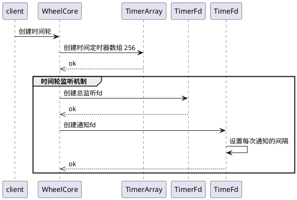

```plantuml
@startuml
participant client
participant WheelCore 

client -> WheelCore : 创建时间轮
WheelCore -> TimerArray : 创建时间定时器数组 256
TimerArray -->> WheelCore : ok
group 时间轮监听机制
WheelCore -> TimerFd : 创建总监听fd
TimerFd -->> WheelCore : ok
WheelCore -> TimeFd : 创建通知fd
TimeFd -> TimeFd : 设置每次通知的间隔
TimeFd -->> WheelCore : ok
end


@enduml
```